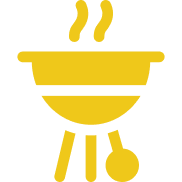

<!-- PROJECT LOGO -->
<br />
<div align="center">
  <a href="">
    
  </a>

  <h3 align="center">Recipe Web App</h3>

  <p align="center">
    <a href="https://frontend-recipes-react.vercel.app/">View Demo</a>
    ·
    <a href="https://github.com/bayuaria33/frontend-recipes-react/issues">Report Bug</a>
    ·
    <a href="https://github.com/bayuaria33/frontend-recipes-react/issues">Request Feature</a>
  </p>
</div>

## Table of Contents

<details>
  <summary>Table of Contents</summary>

  <ol>
    <li>
      <a href="#about-the-project">About The Project</a>
    </li>
    <li>
      <a href="#features">Features</a>
    </li>
    <li>
      <a href="#getting-started">Getting Started</a>
      <ul>
        <li><a href="#prerequisites">Prerequisites</a></li>
        <li><a href="#installation">Installation</a></li>
        <li><a href="#setup-env-example">Setup .env example</a></li>
      </ul>
    </li>
    <li><a href="#screenshots">Screenshots</a></li>
    <li><a href="#contributing">Contributing</a></li>
    <li><a href="#developer">Contact</a></li>
    <li><a href="#license">License</a></li>
  </ol>
</details>
<br/>

## About the Project

Recipes App is an web app designed to exchange and discover recipes for cooking various dishes. It enables users to share recipes, along with detailed ingredient and cooking instructions.

<br/>


## Features

- Authentication
  - (Login, Register)
- B.R.E.A.D

  - Browse recipes
  - Read details
  - Edit recipes
  - Add recipes
  - Delete recipes

## Getting Started

### Prerequisites

Before going to the installation stage there are some software that must be installed first.

- [Node JS](https://nodejs.org/en/download/)

## Backend
- [Backend Repository](https://github.com/bayuaria33/backend-recipes)

## Link APP
- [Website](https://frontend-recipes-react.vercel.app/)


## Tech Stack
This web app was built with: ReactJS, ExpressJS, PostgreSQL, React, Redux,  NodeJS, React-Bootstrap,  Axios, JWT 

## Installation

Clone the project

```bash
  git clone https://github.com/bayuaria33/frontend-recipes-react
```

Go to the project directory

```bash
  cd frontend-recipes-react
```

Install dependencies

```bash
  npm install
```

Start the server

```bash
  npm start
```

## ENV
```
REACT_APP_API_URL=
```

## Screenshots

<details>
    <summary>Show Screenshots</summary>

| Landing Page                            |
| --------------------------------------- |
|  |

| Login Screen                        | Register Screen                           |
| ----------------------------------- | ----------------------------------------- |
|  |  |

| Recipe Details Page                   | Search Recipe                          |
| ------------------------------------- | -------------------------------------- |
|  |  |

| My Recipes Page                        |
| ----------------------------------------- |
|  |

| Add Recipe                          | Edit Recipe               |
| ---------------------------------------- | --------------------------------- |
|  |  |

</details>

## Contributing

Contributions are what make the open source community such an amazing place to be learn, inspire, and create. Any contributions you make are **greatly appreciated**.

1. Fork the Project
2. Create your Feature Branch (`git checkout -b feature/AmazingFeature`)
3. Commit your Changes (`git commit -m 'Add some AmazingFeature'`)
4. Push to the Branch (`git push origin feature/AmazingFeature`)
5. Open a Pull Request

## Developer

<center>
  <table>
    <tr>
      <td align="center">
        <a href="https://github.com/bayuaria33">
          <br/>
          <sub><b>Ariabayu Prayogo Kamilain</b></sub> <br/>
          <sub>Bayuaria33@gmail.com</sub> <br/>
        </a>
      </td>
  </table>
</center>

## License

Distributed under the [MIT](/LICENSE) License.

<p align="right">(<a href="#top">back to top</a>)</p>


This project was bootstrapped with [Create React App](https://github.com/facebook/create-react-app).
